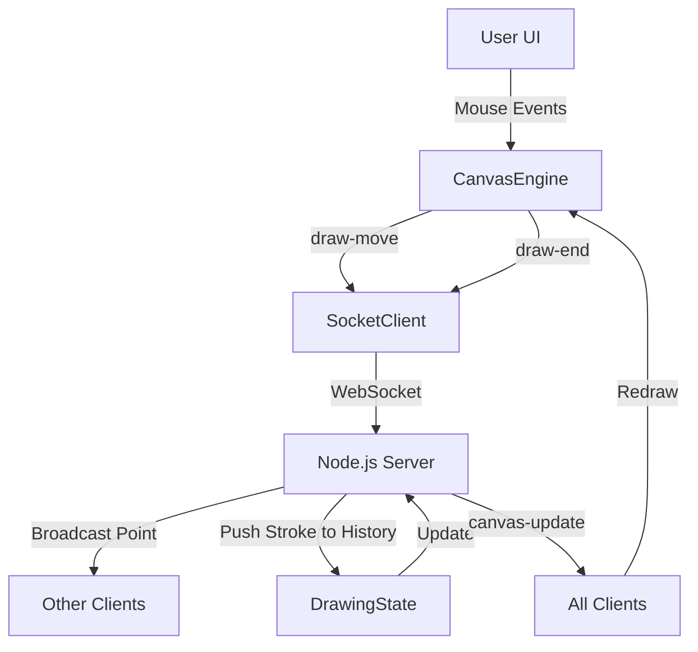

# Architecture Documentation - Co-Draw

## Data Flow Diagram

## WebSocket Protocol

### Client to Server
- `draw-move`: Sent at high frequency during drawing. Contains current `{ point, tool, color, lineWidth }`.
- `draw-end`: Sent when `mouseup` occurs. Contains full `{ points[], tool, color, lineWidth }`.
- `cursor-move`: Sent during mouse movement to sync remote cursor positions.
- `undo` / `redo` / `clear`: Triggers global state changes.

### Server to Client
- `init`: Sent on connection. Contains full `history` and current `users`.
- `draw-move`: broadcasted live points for real-time "seeing as they draw" feedback.
- `canvas-update`: Sent when a stroke is finished, undone, or redone. Contains the updated `history`.
- `user-joined` / `user-left`: Syncs the online users list.
- `cursor-move`: Broadcasts remote cursor positions.

## Undo/Redo Strategy

A **Global History** approach is used.
1. The server maintains a single `history` array.
2. Every `draw-end` adds a stroke to this array.
3. `undo` removes the last stroke from `history` and pushes it to a `redoStack`.
4. All clients receive the updated history and perform a full canvas redraw.
5. While a full redraw might seem expensive, modern browsers handle 10k+ path segments efficiently using the 2D Canvas API.

## Performance Decisions

- **Live Preview**: Individual points are broadcasted via `draw-move` for immediate visual feedback without waiting for a stroke to finish.
- **Batched Redraw**: Redrawing only happens when a stroke is "committed" or "undone", keeping the high-frequency drawing path smooth.
- **Glassmorphism & CSS Blur**: Used for the UI to provide a premium look without sacrificing heavy GPU cycles since the canvas itself is the focus.

## Conflict Resolution

- **Sequential Ordering**: Since the server handles events in the order they arrive (WebSocket reliability), the drawing history is naturally ordered in time. 
- **Global Scope**: Undo/Redo affects the absolute last operation on the server, regardless of who performed it. This ensures all users see the exact same state at all times.
